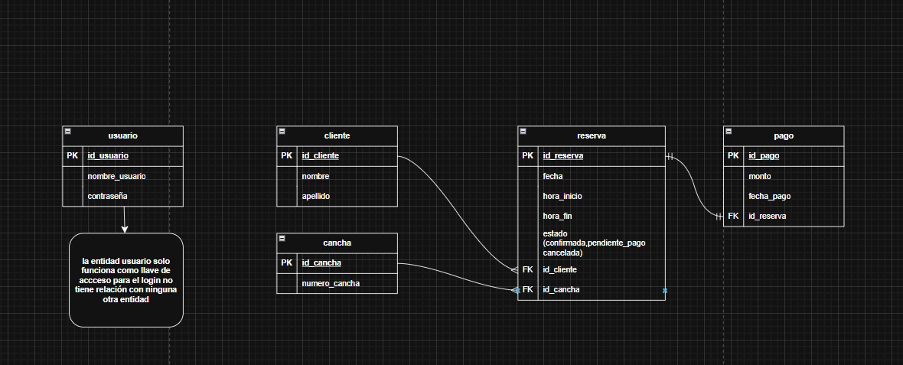

# Sistema Web de Gestión de Reservas - Voley Playa Diloz
Sistema web para la gestión de alquiler de canchas deportivas con control de horarios y registro de pagos en tiempo real. Desarrollado como proyecto para el curso de desarrollo de software en SENATI.

## Descripción del negocio
**Nombre:** VOLEY PLAYA DILOZ  
**Giro:** Alquiler de espacios deportivos (Canchas de Voley Playa)  
**Tamaño:** Pequeña empresa de servicios deportivos  
[cite_start]**Contexto:** Negocio ubicado en el sector de recreación donde la gestión de reservas y cobros se realiza actualmente de forma manual en cuadernos, lo que genera desorden en los horarios y falta de control financiero [cite: 5, 9-10].  
[cite_start]**Justificación:** Se requiere un sistema digital para centralizar la información, evitar cruces de horarios (duplicidad) y permitir una consulta rápida de la disponibilidad de las canchas [cite: 14-15].

## Identificar el problema y solución
[cite_start]**Problema:** La gestión manual en papel provoca errores en el registro de fechas, pérdida de datos de clientes, dificultad para verificar qué canchas están libres en horas pico y falta de trazabilidad en los adelantos o pagos totales de las reservas [cite: 17-23].  
[cite_start]**Solución tecnológica:** Desarrollar una plataforma web con Java Spring Boot y MariaDB que permita automatizar el flujo de reservas, validar la disponibilidad de horarios automáticamente y generar reportes de ingresos mensuales [cite: 49-53].

## Requerimientos Funcionales
| Código | Descripción |
|---|---|
| RF01 | [cite_start]El sistema debe permitir el inicio de sesión seguro para el administrador[cite: 140]. |
| RF02 | [cite_start]El sistema debe permitir registrar y gestionar datos de clientes (Nombre, Apellido) [cite: 82-84]. |
| RF03 | [cite_start]El sistema debe registrar reservas asociando un cliente a una cancha en una fecha y rango horario específico [cite: 89-93]. |
| RF04 | [cite_start]El sistema debe validar automáticamente que no existan dos reservas en la misma cancha y horario [cite: 24-25]. |
| RF05 | [cite_start]El sistema debe registrar pagos (monto y fecha) vinculados a cada reserva [cite: 98-101]. |

## Requerimientos No Funcionales
| Código | Tipo | Descripción |
|---|---|---|
| RNF01 | Seguridad | [cite_start]El acceso al sistema está restringido solo a usuarios autorizados mediante contraseña [cite: 118-119]. |
| RNF02 | Usabilidad | La interfaz debe ser intuitiva, organizada y fácil de operar para el administrador. |
| RNF03 | Integridad | [cite_start]La base de datos debe garantizar que cada pago esté correctamente vinculado a una reserva válida[cite: 78]. |

## Stack completo
1. **Trello** = Gestión del proyecto y seguimiento de tareas (Kanban).
2. **Figma** = Diseño de la interfaz de usuario (UI/UX) y prototipo interactivo.
3. **MariaDB / MySQL Workbench** = Diseño, administración y persistencia de la base de datos.
4. **IntelliJ IDEA** = IDE principal para el desarrollo del Backend (Spring Boot) y Frontend.
5. [cite_start]**Spring Boot** = Framework para la creación de la API REST y lógica de negocio [cite: 49-50].

## Tecnologías utilizadas
- [cite_start]**Java 17** (Lenguaje de programación)[cite: 49].
- **Spring Boot 3** (Framework Backend).
- [cite_start]**MariaDB** (Motor de base de datos relacional)[cite: 52].
- [cite_start]**HTML5, CSS3, JavaScript** (Tecnologías de Frontend) [cite: 46-47].
- **Figma** (Diseño de interfaces).

## Base de datos
[cite_start]El sistema cuenta con 5 tablas principales diseñadas para la gestión del negocio [cite: 66-71]:

| Tabla | Descripción |
|---|---|
| **USUARIO** | [cite_start]Credenciales de acceso para el administrador del sistema (Login)[cite: 118]. |
| **CLIENTE** | [cite_start]Registro de las personas que solicitan el alquiler de canchas[cite: 82]. |
| **CANCHA** | [cite_start]Catálogo de las canchas disponibles para alquiler[cite: 86]. |
| **RESERVA** | [cite_start]Tabla central que gestiona los horarios, fechas y estados de alquiler[cite: 89]. |
| **PAGO** | [cite_start]Registro detallado de los montos abonados por cada reserva[cite: 98]. |

### Diagrama de Modelo Relacional (MR)

*Descripción: Este diagrama representa la estructura lógica de los datos. La tabla **Reserva** actúa como eje central, conectando a los **Clientes** con las **Canchas**. [cite_start]La entidad **Usuario** se mantiene independiente para fines estrictos de autenticación, asegurando que solo el personal autorizado gestione la información [cite: 73-78].*

### Diseño de Interfaz (Dashboard)

*Descripción: El diseño de interfaz muestra un panel de control donde se visualizan las reservas del día, el estado de ocupación de las canchas y un resumen financiero de los ingresos del mes, facilitando la toma de decisiones rápida.*
